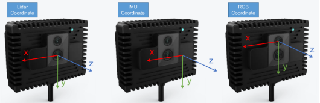
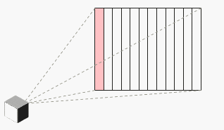
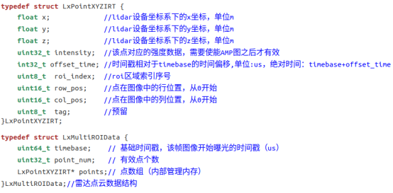

# MRDVS-S10Ultra Mapping

## 前言

此仓库在开源算法基础上，适配MRDVS-S10Ultra雷视一体传感器，基于的开源仓库为：

- https://github.com/hku-mars/FAST_LIO
- https://github.com/hku-mars/FAST-LIVO2
- https://github.com/xuankuzcr/rpg_vikit.git 

在此，感谢以上优秀工作及其卓越贡献。

## LIO系列算法适配

1. 与传感激光雷达曝光方式不同，雷达稳定10Hz时，将Lidar帧时间间隔lid_time_interval置为0.1s
2. 若需适配FAST-LIVO2，为适配相机畸变模型，需编译所提供的rpg_vikit
3. 若需适配FAST-LIVO2，需设置RGB和IMU之间的时间偏置img_time_offset

## MRDVS-S10Ultra

### 特点

- IMU+Lidar+RGB一体
- 大视场角雷达（120H*80V，最远45米）
- 多传感器时间同步
- RGB-D空间对齐
- 可提供轻量化MIPI模组

### 坐标系



### 内参

RGB和Depth的内参为opencv中径向畸变模型，含14个参数，分别为：

```
(k1,k2,p1,p2[,k3[,k4,k5,k6],s1,s2,s3,s4[,tx,ty]]]])
```

- RGB

  可通过SDK获取或者订阅ROS示例中包含RgbInfo的话题

- Depth

  可通过SDK获取或者订阅ROS示例中包含TofInfo的话题

### 外参

- Lidar到IMU的外参（以IMU为基准系）：

  ```
  T_IL = [0.014569, -0.002738, 0.022567, 0, 0, 0]
  ```

- 结构设计外参，依次表示为x, y, z, yaw, pitch, roll, 单位为米（m）、度数（deg）

- Lidar到RGB的外参（以RGB为基准系）：

  可通过SDK接口获取或者订阅ROS中的TF（mrdvs_tof->mrdvs_rgb）

### IMU

IMU型号为博世BMI-088，帧率为200Hz。

### Lidar曝光方式

Lidar为常规帧率（10Hz）时，分两次曝光，每次有12个ROI依次曝光，单个点云单次曝光时间约1ms，最终取其中一次曝光的测距。



### Lidar点云时间戳

Lidar每个点含时间戳，详见SDK中点云结构体定义：



Lidar为常规帧率（10Hz）时，根据点云曝光原理，每个点云的时间戳非递增均匀排列，且最大的时间戳与基准时间戳之间的差值可能远远小于100ms，在适配FAST-LIO系列算法时，可将帧间时间固定为100ms。

注意：早期版本ROS示例录制的rosbag包中单个点云的时间戳为绝对时间，单位：us
